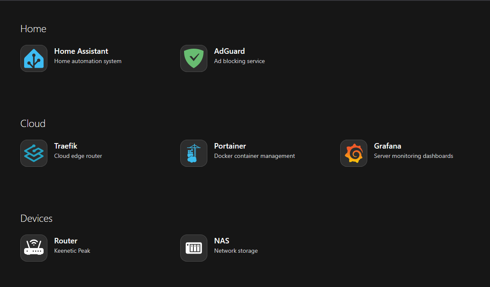

# Getting Started

Welcome! First of all thanks for choosing [Waffle](/) as your Homepage. Here you will learn how to install Waffle and create your first service


## Installation

To run it I will use Docker Compose. It's the easiest way to get Waffle. 

### Docker Compose 
I recommend using this `docker-compose.yml`: 

::: code-group
```yaml [docker-compose.yml]
services:
  waffle:
    image: ghcr.io/danielvici/waffle
    restart: unless-stopped
    container_name: Waffle
    ports:
      - '3000:3000'
    volumes:
      - ./config.yml:/app/data/config.yml
      # - /icons:/app/public/icons # Uncomment if you want to use your own icons.
      # - /favicons:/app/public/favicons # See Favicons for more information
```
:::

::: tip 
If you want the file directly get it [here](https://github.com/danielvici/waffle/blob/72550e8067e62c36e4af94872d58ad84b235d4b1/.example/docker-compose.yml).
:::

### Config File

Now you need a `config.yml`. I will use the following one:

> To find out how to customize your Homepage go to [Configuration](/reference/configuration)

::: code-group
```yaml [config.yml]
title: My Home Page
services:
  Home:
    - title: Home Assistant
      description: Home automation system
      link: '#'
      icon:
        name: simple-icons:homeassistant
        wrap: true
        color: '#3dbcf3'
    - title: AdGuard
      description: Ad blocking service
      link: '#'
      icon:
        name: simple-icons:adguard
        wrap: true
        color: '#68bc71'

  Cloud:
    - title: Traefik
      description: Cloud edge router
      link: '#'
      icon:
        name: devicon:traefikproxy
        wrap: true
    - title: Portainer
      description: Docker container management
      link: '#'
      icon:
        name: devicon:portainer
        wrap: true
    - title: Grafana
      description: Server monitoring dashboards
      link: '#'
      icon:
        name: logos:grafana
        wrap: true

  Devices:
    - title: Router
      description: Keenetic Peak
      link: '#'
      icon:
        name: bi:router-fill
        wrap: true
    - title: NAS
      description: Network storage
      link: '#'
      icon:
        name: mdi:nas
        wrap: true
```
:::

Place your `config.yml` in the same folder as your `docker-compose.yml`

### Run Container

Now you can start the container. To do this execute the following command in the same folder as the `docker-compose.yml` and your `config.yml`:

::: code-group
```shell [Linux]
sudo docker compose up -d
```

```shell [Windows]
docker compose up -d
```

```shell [MacOS]
docker compose up -d
```
:::

### Post Install

Great! Your Homepage is now ready to use!

Access it via `http://<your-machine-ip>:3000`.  

The site should look like this (if you chose to use the example `config.yml`):




Enjoy using Waffle! 

::: tip 
Want to learn more how to customize your Homepage? [Learn more](/reference/configuration)
:::
